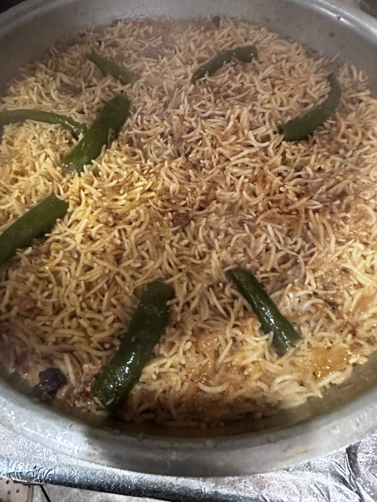

Photo Credit: Hala Jafri

Difficulty: Medium

# Ingredients
* 1kg (or 2 pounds) beef or mutton
* 3½ to 4 cups rice

### For yakhni
* 2 big onions
* 2 tbsp ginger
* 2 tbsp garlic
* 2 tbsp coriander (_dhania_) seeds
* 2 tbsp fennel (_saunf_) seeds
* 6-8 cloves (_laung_)
* 8-10 black peppercorns (_kali mirch_)
* 6-7 green cardamon (_hari elaichi_) pods
* 5-6 black cardamom (_badi elaichi_) pods
* 2 cinnamon (_dalchini_) sticks
* 2 big bay leaves (_tez patta_)
* Salt, to taste

### For paste
* 2 tbsp ginger
* 2 tbsp garlic
* 2-4 red chiles (_lal mirch_)
* 1 tsp black pepper (_kali mirch_) powder
* 1 tsp garam masala
* 10-12 black peppercorns (_kali mirch_)
* 1-2 tsp cumin (_zeera_) powder
* 1-2 star anise
* 1 tsp coriander (_dhania_) powder
* ½ cup yogurt

# Directions
Boil the meat in all the spices above to make a yakhni. Separate the water and meat and keep the yakhni aside. Make a paste of ginger, garlic, whole red chiles and black pepper.

Quarter 2 onions and fry in oil. Then, add the boiled meat with the paste that you made and roast it. Add some salt and garam masala along with dahi (½ cup) and then roast until oil floats on top.

Now add the yakhni water (you can remove excess khada masala we put in earlier and discard or retain some for flavor). Keep a ratio of 1 cup rice to 2 cup water. Cook on high for five mins or until it starts boiling. Taste the water - it should taste salty or else the pulao will be bland.

Add 4-5 serrano chiles on top (optional). Then, lower the gas flame and put on dum (5-7 mins) until the rice is cooked. Don’t open the lid. Let is sit in the pot for another 5-7 mins and then serve.
